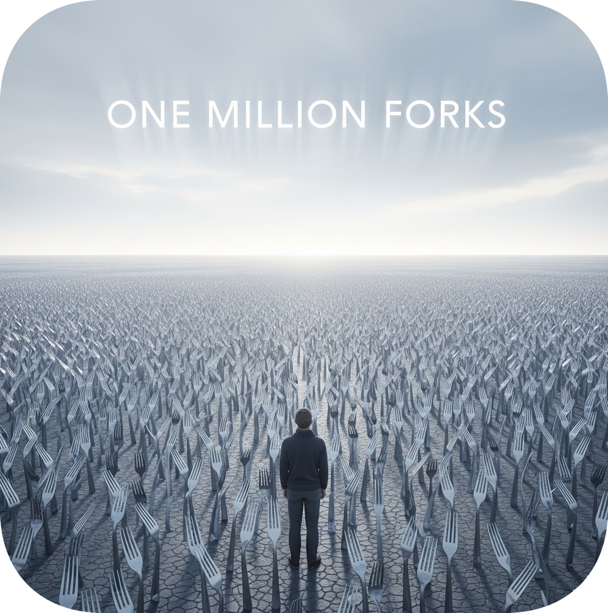

# One million forks 🍴 X 1M

## FORKS COUNT: 1

## Join the Movement!

Want your name in the Hall of Fame? Just hit the "Fork" button. This is the _biggest_ (and __silliest__) social experiment on GitHub, and your profile is a key part of it. Get your name on the list, and let's see how long we can make it!

## Our last 10 forkers:

- <a href="https://github.com/Fund-AEON"> Fund AEON | Critical Life Extension Foundation (@Fund-AEON)</a> - *Fund AEON - Critical Life Extension Foundation*
- 💫 Become a first of the 10 forkers! 💫

## Why Fork?
Forking this repository is a fun way to be part of a global community. Each fork represents a unique individual who has joined in on this quirky project. Plus, it's a great conversation starter!

## Milestones

- 🥇 This project got its first fork from [Fund AEON | Critical Life Extension Foundation](https://github.com/Fund-AEON) (@Fund-AEON)

- No milestones yet. Be the first to set one!

## EOF 
  
